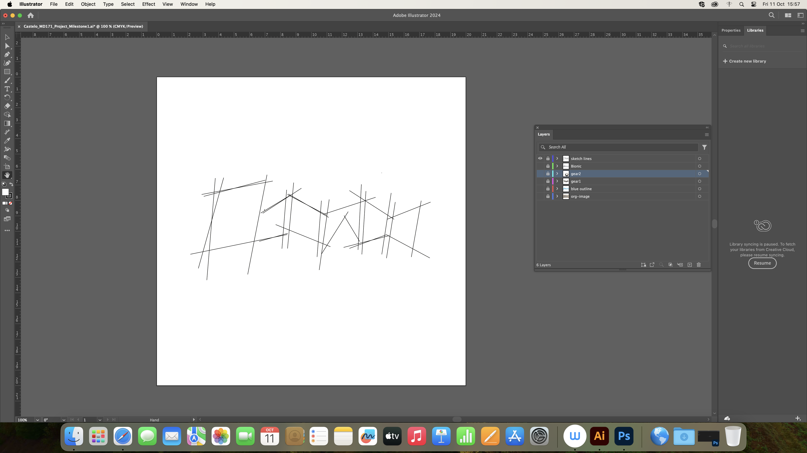
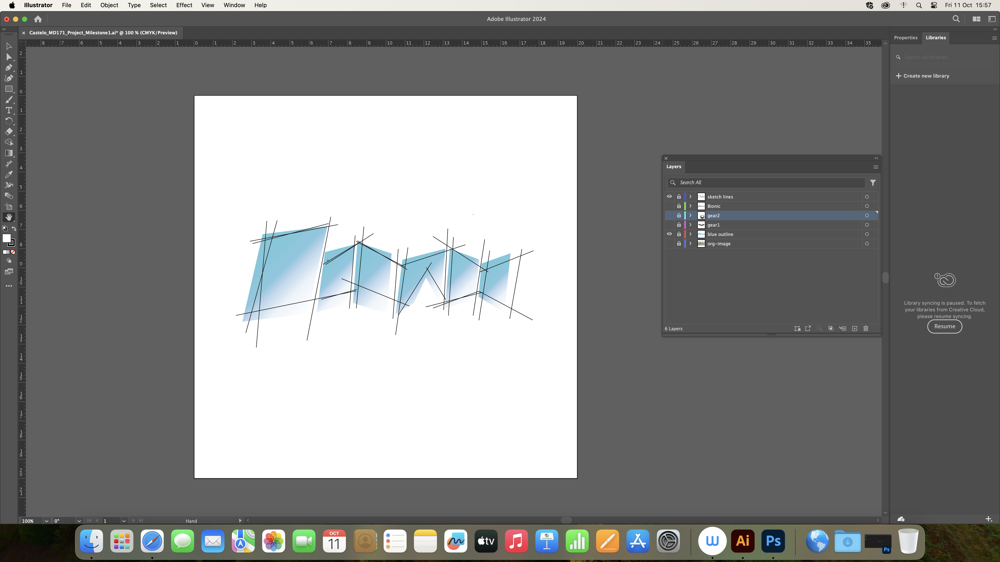
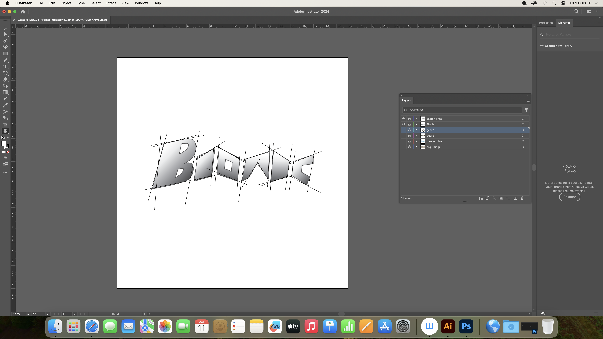
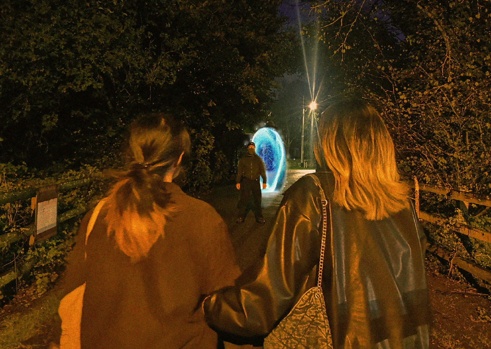
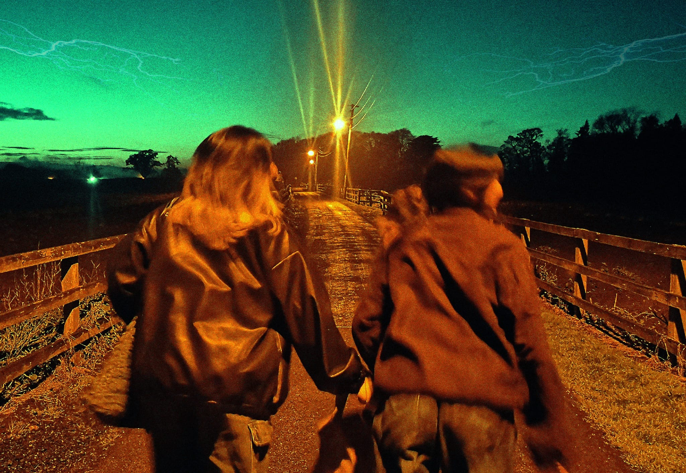
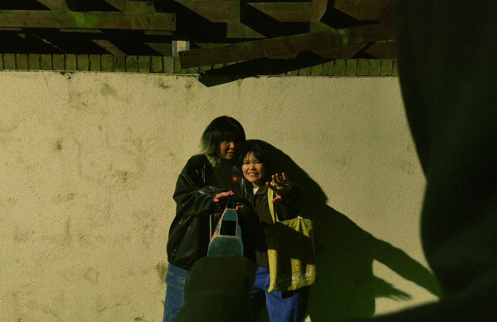
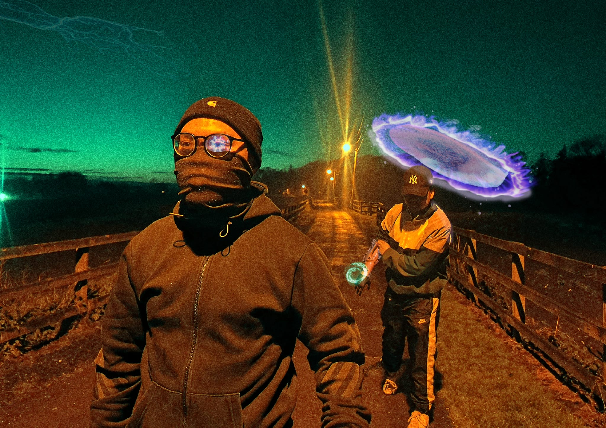

# Bionic
MD171 Foundations of Media Design.  
Theme: contribute to a pitch deck for a new Sci-Fi series set in the West of Ireland.  
Designed using Adobe Photoshop and Illustrator. 

### The project
`Bionic` is a cliché sci-fi series about an entity, unknown of good or bad, in pursuit of their enemy. However in admist of the dispute, two girls encounter these beings unknown of the situation they're in. 

- `Analysis.pdf`: about the title design
- `Milestone2_Analysis.pdf`: about the four photographs portraying a story 
- `Milestone3_Analysis.pdf`: about the collage. 

All contain explanations on the intention of my designs and the tools used throughout the process. Why I've used went with these choices and how does this make an effect towards the end result of each part of the project. 

### Criteria
- Come up with a name for the series and create a logo design for the series
- Create a story in four photographs demonstrating composition and elements of design.
- Design a collage image that pertains to your series. 

### Title Design

 

#### Snippet of the process

 

  
  
 
  
 

### Four photographed storyboard

Photo Story One and Two 

 
  

Photo Story Three and Four 

    
  

#### Snippet of the process

 

  
  
 
  
 

### Collage

 

#### Snippet of the process

 

  
  
 
  
 

